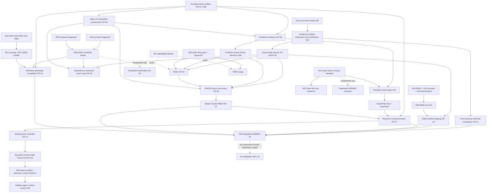

# REMORA Cross-Idea Synthesis Graph

**Purpose:** dependency graph across the complete preserved research record. Batch boundaries are not used for theory; live implementation gates remain binding.
**Authority:** `COMPLETE_RESEARCH_GRAPH.md` for `H01–H39`/`N01–N26`; `REMORA_NEW_IDEA_MASTER_MANIFEST.md` for manifest ideas `1–30` and `TBEH`.
**Status:** static synthesis; no production code, no live GPU.

## 1. Graph legend

- `E` = exactness/authority dependency;
- `M` = movement/residency dependency;
- `S` = scheduling/control dependency;
- `P` = provenance/certificate dependency;
- `Q` = quality/ability dependency;
- `G` = gate/authorization dependency;
- `MUTEX` = competing representation or policy in one A/B;
- `TRANSFER` = analysis may transfer, evidence does not;
- `BLOCKED` = source/gate missing.

## 2. High-level synthesis graph



## 3. Theory nodes and cross-family equivalences

| Synthesis node | Mathematical object | Preserved families joined | Discovery status |
|---|---|---|---|
| Verified-token state transition | `state + candidate work -> accepted prefix + state' + debt` | TBEH, PHASE, RSSO, Portion, Reclaim, H08/H15/H21/H25 | `DERIVED UNDER ASSUMPTIONS` |
| Causal closure | Merkle root of transitive inputs/state/implementation | dependency-versioned cognition, ExpertPack, LayerPack, H10, H33, N09/N25 | `CONJECTURED` pending checker |
| Accepted-token roofline | `T >= max(resource load, critical path)` | H38, DSpark/PHASE, RSSO, ExpertPack, N02/N23 | `PROVED` accounting inequality |
| Value-weighted demand | cost-weighted miss/branch/route value | Predictive expert route selection, predictive residency, PHASE, salvage, long-horizon structural adaptation | `DERIVED UNDER ASSUMPTIONS` |
| Nested approximation lattice | exact authority, residual refinement, verified draft, approximate body | H03–H05/H07/H23/H24, delta skip, N17/N19–N21, Symbiote | `CONJECTURED` |
| Resource-constrained DAG | precedence + resource vectors + capacity | H13/H17/H18/H22/H29/H37, REMORA Flow, hardware phenotype | `DERIVED UNDER ASSUMPTIONS` |
| Certificate interface closure | Hoare-style `Pre/Post` state boundary | H02/H33/H39, Q2, RSSO, REMORA Verify | `CONJECTURED` |
| Work/value ledger | one-time realized credit minus overhead/debt | REMORA Reclaim/Waste/Portion, H27/H28, N26 | `PROVED` by ledger definitions |

## 4. Exactness and authority spine

```text
H02 source-of-truth correctness modes
  -> H33 Evidence-Certified Exploration and Verification
  -> OP-11 proof-carrying composition
  -> OP-03 authoritative state boundary
  -> OP-04 delta bound + route/state condition
  -> OP-05 dependency closure
  -> H39 only after component interfaces close
```

Important negative edges:

```text
H33 local PASS -/-> H39 integrated PASS
Q2 one-layer exact -/-> dense Qwen RSSO exact
Qwen greedy token match -/-> recurrent state equality
calibrated confidence -/-> exactness certificate
reduced bytes -/-> speed result
```

## 5. Movement/residency spine

```text
H10 persistent expert atlas
  -> H11 ExpertPack / RSSO LayerPack
  -> H13 asynchronous lanes
  -> OP-07 resource scheduler
  -> OP-02 accepted-token roofline
  -> H38 exposed-byte budget

N01 Qwen compact transport
  -> N02 full-core residency
  -> N23 GEMV/GEMM shape path
  -> H10/H13

H06 Predictive Expert Route Selection + H07 MARC margin calibration
  -> OP-08 predictive residency bounds
  -> H15 route control / H17 admission control
```

The central derived condition is:

```text
predictive residency is useful only when
value-weighted avoided critical-path cost
> load + hold + pollution + contention cost,
AND residual exposed demand crosses the roofline.
```

## 6. Horizon/branch spine

```text
manifest 1/2 Elastic MTP + manifest 5 PHASE
  -> OP-01 elastic optimal stopping
  -> TBEH conservative tail bound
  -> OP-06 branch-DAG economics
  -> OP-03 RSSO break-even
  -> H21 batched work/scoped repair
  -> H24 risk-weighted verification
  -> H29 viability control / H34 bounded controller
```

`TBEH` is explicitly `THEORETICAL / OFFLINE-REPLAY ONLY`; no edge here authorizes a live controller while B0 is blocked.

## 7. MARC/Symbiote spine

```text
N04 semantic fingerprints + N05 hardware fingerprints
  -> N09 MARC-Symbiote joint binder
  -> explicit primitives:
     KEEP_SLOT, PREFETCH_EXPERT_UNION, GROUP_BY_EXPERT,
     USE_ANCHOR, APPLY_REFINEMENT, REQUEST_AUTHORITY,
     REFRESH_HOST, HALT
  -> OP-05 dependency closure
  -> OP-10 phenotype compilation
  -> shadow mode only
```

`H07 MARC` is **Margin-Aware Routing Calibration**. `N06–N09 MARC` are **Modular Architecture with Routing and Control** lineage. The acronym alone is ambiguous and must not be used as an identifier.

Qwen-to-DeepSeek edges are `TRANSFER` only:

```text
Qwen field/schema methodology -> DeepSeek adapter calibration
Qwen dimensions/routes/thresholds/results -/-> DeepSeek evidence
```

## 8. Compression and format spine

```text
N10 REAP -> N11 Laguna -> N12 pruning -> N13 AutoSurgeon
                                  -> N14 coverage-first
                                  -> N15 precision-first
                                  -> N16 heterogeneous
N19 R4I8 -> N20 R5I8 -> N21 R6I8   [names preserved, implementations not implied]
N19/N20/N21 -> N22 cooperative matrix -> N23 GEMV/GEMM
```

These are model-production/approximation branches. They do not replace N01 Q2 exact transport or the dense Q8 authority. `N13 AutoSurgeon` is preserved but its exact durable artifact is unlocated: `BLOCKED`.

## 9. Full preserved HERMES identifier ledger

| ID | Preserved name |
|---|---|
| H01 | consumer-hardware frontier-model challenge |
| H02 | source-of-truth correctness modes |
| H03 | compact expert skeleton |
| H04 | P1/P2/P4/P6 progressive MoE |
| H05 | Q8 residual tiles |
| H06 | Predictive Expert Route Selection |
| H07 | margin-aware routing calibration |
| H08 | Speculative Future-State Scheduling |
| H09 | expert-major multi-position batching |
| H10 | persistent expert atlas and stable slots |
| H11 | ExpertPack |
| H12 | RDNA4-native execution |
| H13 | asynchronous three-lane pipeline |
| H14 | Global Runtime Telemetry |
| H15 | Receding-Horizon MoE Route Control |
| H16 | Risk-Aware Operating Profiles |
| H17 | Admission Control and Queue Metering |
| H18 | Multi-Source Expert Placement |
| H19 | Sustainable Operating-Point Selection |
| H20 | Resource Fatigue and Recovery Control |
| H21 | Batched Work and Scoped Repair |
| H22 | Adaptive Resource Budgeting |
| H23 | Staged Uncertainty Filtering |
| H24 | Risk-Weighted Verification Budget |
| H25 | Outcome-Driven Policy Learning |
| H26 | Constraint-Gated Action Selection |
| H27 | Salvage-Aware Work Valuation |
| H28 | Energy-Normalized Capability Measurement |
| H29 | Viability-Region Runtime Control |
| H30 | Long-Horizon Structural Adaptation |
| H31 | Multi-Timescale Modular Control Plane |
| H32 | startup autotuner |
| H33 | Evidence-Certified Exploration and Verification |
| H34 | reasoning-distilled inference controller |
| H35 | E1 compact-skeleton program |
| H36 | E2 non-MoE floor program |
| H37 | kernel/configuration lead program |
| H38 | accepted-token roofline/exposed-byte budget |
| H39 | integrated HERMES-V4 architecture |

## 10. Full preserved broader-family identifier ledger

| ID | Preserved name |
|---|---|
| N01 | Qwen compact expert transport |
| N02 | Qwen full-core GPU residency |
| N03 | Qwen-first experimentation |
| N04 | semantic fingerprints |
| N05 | hardware fingerprints |
| N06 | MARC-X |
| N07 | MARC-OS |
| N08 | MARC-Synapse |
| N09 | MARC-Symbiote temporary execution body |
| N10 | REAP |
| N11 | Laguna |
| N12 | pruning |
| N13 | AutoSurgeon |
| N14 | coverage-first compressed variant |
| N15 | precision-first compressed variant |
| N16 | heterogeneous compressed variant |
| N17 | MoE-Skipper cascade and correction systems |
| N18 | DSpark/MTP restoration and custom runtime |
| N19 | R4I8 |
| N20 | R5I8 |
| N21 | R6I8 |
| N22 | RDNA4 cooperative-matrix kernels |
| N23 | RDNA4 GEMV/GEMM kernels |
| N24 | context-only streaming |
| N25 | associative memory |
| N26 | autonomous local self-experimentation |

## 11. REMORA manifest identifier crosswalk

| Manifest ID | Preserved name | Theory node / major dependencies |
|---:|---|---|
| 1 | Elastic MTP generation depth | OP-01; H08/H15/H21/H38 |
| 2 | Elastic verification depth / continuous horizon | OP-01; H15/H23/H24 |
| 3 | Neuralink/REMORA future packets | OP-01/OP-06; H08/H14 |
| 4 | Multi-drafter fusion | OP-01/OP-03; H08/H21 |
| 5 | PHASE outcome-tree prediction | OP-06; H08/H09/H17 |
| 6 | RSSO resident skeleton + streamed oracle | OP-03; H03/H33/H38 |
| 7 | Layer-stationary speculative wavefront | OP-03/OP-07; H09/H13 |
| 8 | Small speculative wavefront tree | OP-06/OP-03; H21 |
| 9 | Latent Inertial Drafting | OP-03; H03/H35 |
| 10 | Dense organ map by value per byte | OP-02/OP-09; H28/H30 |
| 11 | REMORA Portion | OP-01/OP-06/OP-09 |
| 12 | REMORA Reclaim | OP-05/OP-09 |
| 13 | Computational refrigerator / artifact provenance | OP-05/OP-09 |
| 14 | Value-weighted salvage cache | OP-05/OP-08/OP-09 |
| 15 | Waste Ledger / circular efficiency | OP-09 |
| 16 | Tiered Inference Reserve | OP-07/OP-09/OP-10; H20/H29 |
| 17 | Reserve mobilization | OP-07/OP-09; H17/H29 |
| 18 | Moving maintenance setpoint | OP-01/OP-07/OP-12 |
| 19 | Uncertainty-adjusted safe surplus | OP-01/OP-07; H23/H24 |
| 20 | Fast/slow adaptation clocks | OP-07/OP-12; H20/H30 |
| 21 | Portable parasitic neural hypervisor | OP-10/OP-11; N09 |
| 22 | REMORA Link / host receptor | OP-05/OP-11; N09 |
| 23 | REMORA Morph | OP-10; N05 |
| 24 | REMORA Flow | OP-07/OP-10; H13/H18 |
| 25 | REMORA Verify / progressive escalation | OP-03/OP-04/OP-11; H02/H33 |
| 26 | Dependency-versioned cached cognition | OP-05 |
| 27 | Delta-Certified skipping | OP-04 |
| 28 | Native hardware-morphic Symbiote | OP-10/OP-12; N09 |
| 29 | Universal learned parasite / Neuralink MTP | OP-01/OP-05; H34/N09 |
| 30 | Dense-to-MoE translation | OP-03/OP-08/OP-10; transfer matrix |
| TBEH | REMORA Tail-Bounded Elastic Horizon | OP-01/OP-06; B0 gate |

## 12. Dependency status by lane

| Lane | Critical path | Current result |
|---|---|---|
| DeepSeek HERMES | H02 → H33 → H35/H36/H38 → H10/H11/H13 | transport/certificate evidence; full integrated path not established |
| Qwen Q2 | N03 → N01 → N02/H10/N23 | Q2 scoped exact transport/placement PASS; no speed winner |
| Dense Qwen RSSO | N03/B0 → RS0–RS6 → OP-03 | B0 repeatability blocker; RSSO hot path unauthorized |
| TBEH | B0 → valid MTP traces → held-out replay → gate | `THEORETICAL / OFFLINE-REPLAY ONLY` |
| MARC-Symbiote | N04+N05 → P1/P2 twin → shadow → bounded application | static/trace-only; no executor |
| Compression | N10/N11 → N12/N13 → N14–N16; N19–N23 | variant/design lanes; quality/performance scoped or open |
| Autonomous research | H02/H14/H29/H33 → bounded queue | method exists in pieces; no authority to bypass gates |

## 13. Graph-level conclusions

1. The exactness spine is a prerequisite to all speed/quality claims.
2. The roofline is a necessary filter, not an optimization.
3. Residency, horizon, and branch policies must share one accepted-token ledger.
4. Semantic/hardware fingerprints are useful only as state descriptors with expiry and fallback.
5. H39 is an integration contract, not permission to multiply isolated result numbers.
6. The missing idea ranking and B0 repeatability closure are unresolved graph inputs; both remain explicit `BLOCKED` nodes.
