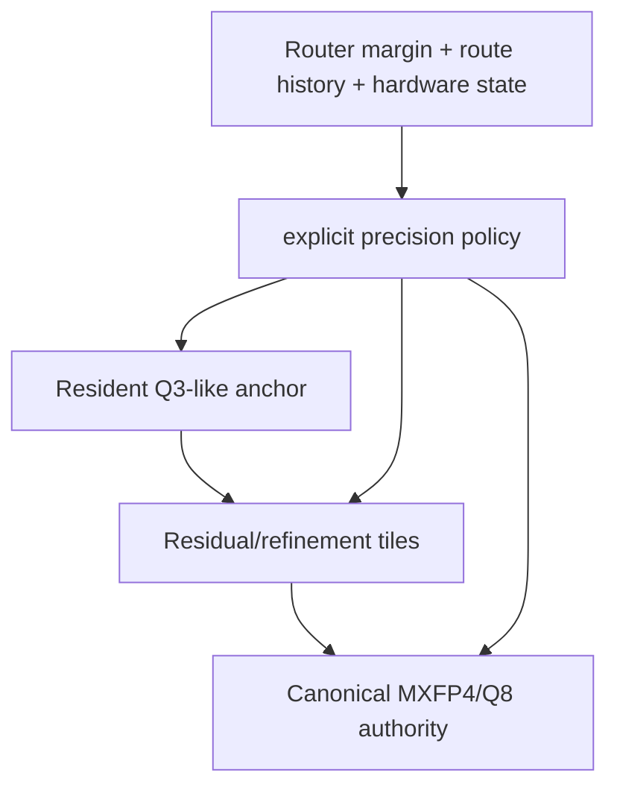

# Compression and Precision Architecture

## What the evidence supports

1. **Independent Q3_K and Q4_K are not a nested ladder.** Q3_K uses 256-value super-blocks, 16×16 subgroups, no minimum/offset, and packed six-bit scales. Q4_K uses 8×32 subgroups with affine min/scale packing. A Q3 byte stream cannot be refined into direct Q4 bytes.
2. **Q3_K is the near-term skeleton candidate** because E1 retains the greedy sequence through 24 layers (9/9) and uses less bandwidth than Q4_K.
3. **Q4_K is not automatically compact:** at this geometry Q4_K can exceed MXFP4 bytes; its full-depth anomaly was transport corruption, not proof that Q4 representation is bad.
4. **Long-term progressive precision requires a new encoding or sidecar:** anchor + residual tiles, bit planes, or explicit authority reload. Independent full tensors waste storage and do not reuse lower-precision bytes.
5. **Dynamic route-conditioned precision is a proposal, not a current runtime.** It must be fail-safe: false-safe escalates to authority; it must not change router semantics.

## Candidate hierarchy

## E1 evidence table

| Config | Greedy identity | RMS | Interpretation |
|---|---:|---:|---|
| Q2_K × 4 | 13/13 | 0.237 | shallow only |
| Q2_K × 12 | 5/13 | 0.353 | degraded |
| Q2_K × 24 | 5/9 | 0.604 | weak |
| Q3_K × 4/12/24 | 9/9 at k=24 | 0.212/0.375/0.489 | strongest measured skeleton depth |
| Q3_K × 43 | no generation | 0.703 | phase-only full depth; valid after transport gate |
| Q4_K × 4/12 | 13/13 | 0.252/0.209 | strong shallow path |
| Q4_K × 24 | 5/9 | 0.235 | RMS and sequence disagree |
| original Q4_K × 43 | not interpretable | 2.708071 | **invalid: 602 skipped uploads** |

## Safe claim boundary

These observations measure approximate compact-vs-canonical logits/greedy sequences on one prompt and frozen settings. They do not establish universal quality, exactness, accepted-token economics, or production throughput.

## Code path

See [[Code/Code-Path-Map]] and [[Code/Important-Symbols]] for tensor type/stride and native MMID paths.

## Authority

- `[local path omitted]`
- `[local path omitted]`
- `[local path omitted]`
- `[local path omitted]`
- `[local path omitted]` (source-tree counterpart: `llama.cpp/src/dsv4_skeleton_store.h`)
