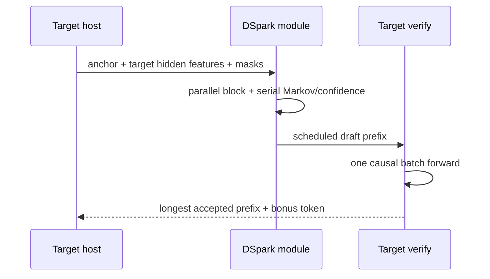

# DSpark / MTP Architecture

## Four-layer presence rule

| Layer | Official DeepSeek-V4-Flash-0731 | Unsloth UD-Q8_K_XL GGUF | HERMES runtime |
|---|---|---|---|
| **A — present in model** | **Yes:** 4,705 `mtp.*` keys in official index; stages 0–2 in shards 46–48 | n/a | n/a |
| **B — preserved in conversion** | n/a | **No:** 1,328 trunk tensors, zero `mtp/dspark/markov/conf` names | n/a |
| **C — loaded** | official path only | n/a | **No** |
| **D — executed** | official DSpark path | n/a | **No** |

The converter's `DeepseekV4Model.filter_tensors` drops `mtp.*`; it does not rename or prove that official 0731 lacks DSpark. The first GGUF shard is metadata-only, so searching only its header was a methodology error.

## Official configuration

- `n_mtp_layers=3`
- `dspark_block_size=5`
- Markov rank 256
- target feature layers `[40, 41, 42]`
- official names retain `mtp.{0,1,2}.*`, including `main_proj`, MoE stages, `markov_head`, and `confidence_head`.

## Algorithmic distinction

DSpark is a semi-autoregressive block drafter: a parallel backbone receives target features and masked/anchor positions; a small serial Markov stage produces a chain with per-position confidence; a confidence scheduler chooses a non-anticipating verification prefix; the target verifies that prefix in one causal multi-position forward and accepts the longest valid prefix. It is not ordinary “small model guesses one token” speculative decoding, although it shares rejection/verification principles.

## HERMES status

HERMES compact execution is sequential/single-position. `llama-server` has a generic true multi-token target batch path, but expert-union physical load reuse is not instrumented. A batch is not proof of fewer expert transfers. Before DSpark can be a HERMES claim, the project needs: a conversion/export mapping for `mtp.*`, a loader/draft graph, target multi-position compact IDs, exact KV rollback/acceptance, physical-load counters, and matched sequential-vs-block verification.

## Correctness invariants

- target state is immutable until acceptance is known;
- only accepted prefix commits to KV;
- reject suffix is not committed;
- staging lives until all fences complete;
- tokenization/sampling semantics match;
- greedy identity is weaker than stochastic rejection-sampling exactness;
- confidence may schedule length but cannot replace rejection sampling.

## Safe conclusion

DSpark restoration is a future conversion/runtime lane, not an E1 prerequisite. Do not claim that the current GGUF has DSpark under another name, and do not claim accepted-token benefit on RX 9060 XT without a true block verification/load experiment.

## Code path

The conversion/runtime boundary is indexed in [[Code/Code-Path-Map]] and [[Code/Important-Symbols#DeepseekV4Model.filter_tensors()]].

## Authority

- `[local path omitted]`
- `OFFICIAL_TENSOR_MAP.md`, `CONVERTER_GAP_MAP.md`, `BLOCK_VERIFICATION_MATRIX.md`
- `[local path omitted]`
- `[local path omitted]`
- `[local path omitted]`
