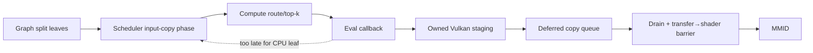

# Transport Contracts

These are the invariants that distinguish an evidence-valid compact run from a fast but stale/garbage run.

## Contract 1 — authority span

For every `(layer, expert, projection)`, DSEI v2 file index, offset, byte size, quant type, and bounds must match the GGUF loader geometry. A missing or partial gate/up/down triplet is fatal.

## Contract 2 — callback ordering

The scheduler can copy graph leaves before it computes the split and invokes the eval callback. Therefore CPU-arena population in the callback is too late for a scheduler-created GPU copy. The Vulkan path bypasses this dependency by writing owned host-visible staging and deferring copies into persistent Vulkan tensors.

## Contract 3 — slot identity

`original_expert_id → local_slot` is authoritative. Destination offsets must use `slots_out[e]`, not router rank `e`. A rank permutation must not alter the result if the same expert bytes remain in the same physical slot.

## Contract 4 — staging lifetime

Recording a Vulkan copy does not mean its source bytes are no longer needed. Staging bytes may be recycled only after the fence/epoch that covers all submitted consumers. The conservative HERMES repair is monotonic allocation through a decode epoch and reset at the next epoch boundary. A long-term finer-grained event guard is prior-art-informed but not yet the active contract.

## Contract 5 — epoch publication

NT stores must be globally visible before the worker publishes completion. The fixed pool uses `_mm_sfence()` and release/acquire completion. A worker from an older epoch must not overwrite a newer epoch's staging.

## Contract 6 — IDs are per position

The current compact callback reads one six-ID route vector. Multi-position execution cannot broadcast it. Any batched path must read, stage, and validate one ID vector per position, or fail closed.

## Contract 7 — route determinism

Near-tie top-k order is part of the comparison. The validated configuration uses CPU argsort. If a different argsort path is tested, record selected IDs, margins, and route hashes; a route change is not a weight transport mismatch.

## Contract 8 — fail closed

`staging alloc failed`, unknown expert, copy/lookup failure, stale slot, invalid source range, or nonzero `staging_failures` invalidates the decode. Never continue using an uninitialized or prior-epoch slot.

## Phase-0 verification chain

- Upload verifier: `hermes_verify_upload.py`, 214/214 on the five-token Phase-B test.
- Control Hello: RMS 0.041156, max abs 0.241005, repeatable.
- Control capital prompt: RMS ~0.33, 13/13 greedy generation identity.
- Certificate tools independently re-derive markers from logs and binary/diff hashes.

## Authority

`[local path omitted]`, `[local path omitted]`, `[local path omitted]`, and the source files named in [[Code/Code-Path-Map]].
